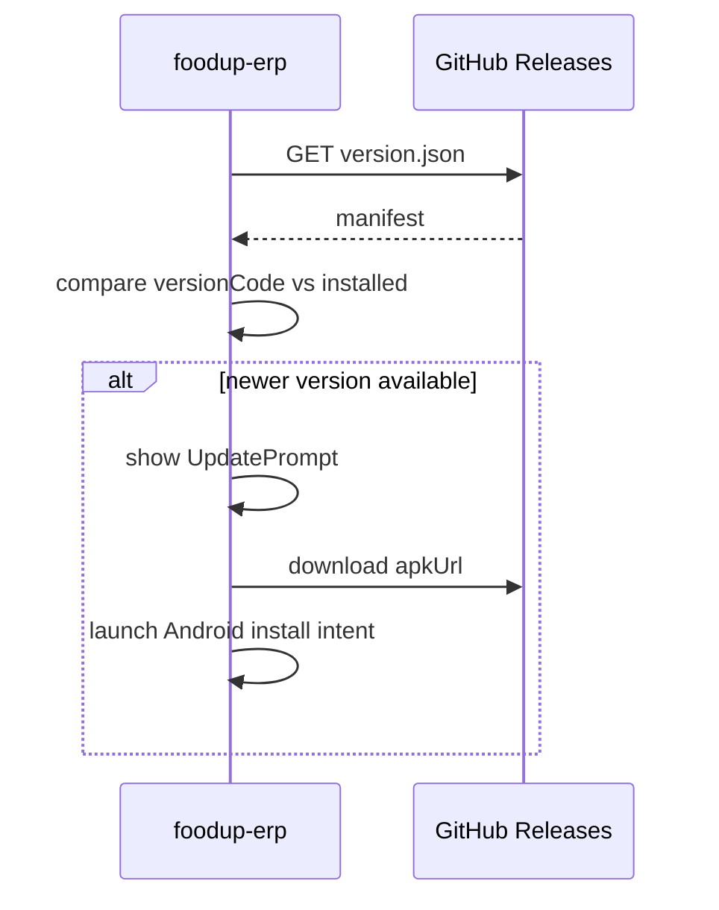

# OTA Manifest (`version.json`)

## Fetch URL

The foodup-erp app fetches the manifest from:

```
https://github.com/JiaYee/foodup-erp-releases/releases/latest/download/version.json
```

This URL serves the `version.json` **asset** attached to the latest GitHub Release — not the file on a git branch.

Defined in foodup-erp `src/updates.ts` as `UPDATE_MANIFEST_URL`.

## Schema

Current example (`version.json` in this repo):

```json
{
  "versionCode": 19,
  "versionName": "1.0.19",
  "apkUrl": "https://github.com/JiaYee/foodup-erp-releases/releases/download/v1.0.19/foodup-erp-1.0.19.apk",
  "sha256": "6dd9964a300f5da82ff2a59fea0594e84b08b257db3bc9bc05b27782ad8a67f8",
  "minSupportedVersionCode": 1,
  "notes": "Fix Restore from cloud failing when cloud has duplicate category names.",
  "mandatory": false
}
```

## Field reference

| Field | Type | Required | Description |
|-------|------|----------|-------------|
| `versionCode` | integer | Yes | Android `versionCode` — must be > 0; client compares this |
| `versionName` | string | Yes | User-visible semver (e.g. `1.0.19`) |
| `apkUrl` | string | Yes | Direct download URL for the APK on GitHub Releases |
| `sha256` | string | No | SHA-256 hash of APK (lowercase hex) — written by release script |
| `minSupportedVersionCode` | integer | No | Oldest supported client versionCode (default: 1) |
| `notes` | string | No | Release notes shown in update prompt |
| `mandatory` | boolean | No | If true, user cannot dismiss update (default: false) |

## How fields are generated

The release script (`scripts/release.ps1`) writes all fields:

- `versionCode`, `versionName` — from script parameters
- `apkUrl` — constructed as `https://github.com/{GithubRepo}/releases/download/v{VersionName}/foodup-erp-{VersionName}.apk`
- `sha256` — computed from copied APK via `Get-FileHash -Algorithm SHA256`
- `minSupportedVersionCode` — from `-MinSupportedVersionCode` parameter (default 1)
- `notes` — from `-Notes` parameter
- `mandatory` — always `false` (not yet parameterized)

## Client behavior (foodup-erp)

Implemented in `src/updates.ts` and `src/components/UpdatePrompt.tsx`:



1. Fetch manifest from `UPDATE_MANIFEST_URL` (15s timeout)
2. Parse and validate required fields (`versionCode`, `versionName`, `apkUrl`)
3. Compare manifest `versionCode` against installed Android `versionCode`
4. If newer: show update prompt with `notes`
5. On user accept: download APK to cache, launch Android package install intent
6. Check `minSupportedVersionCode` — if installed version is below, treat as mandatory
7. Check `mandatory` flag — if true, user cannot dismiss

## Known gaps

| Gap | Details |
|-----|---------|
| **sha256 not verified** | Manifest includes hash but `src/updates.ts` parses but does **not verify** after download |
| **No delta updates** | Full APK download only — no incremental patches |
| **Android only** | OTA logic runs on Android; iOS/web not supported |
| **No auto-update** | User must accept install prompt (Android security model) |

## APK URL pattern

```
https://github.com/JiaYee/foodup-erp-releases/releases/download/v{VersionName}/foodup-erp-{VersionName}.apk
```

Example: `v1.0.19` → `foodup-erp-1.0.19.apk`

## Relationship to git `version.json`

The git-tracked `version.json` in this repo reflects the latest release commit. However, **OTA clients fetch from GitHub Release assets**, not from git branch HEAD. After publishing, the Release asset is the authoritative manifest.

If `develop` is ahead of `main`, the git file on either branch may not match what devices fetch — always verify via the Release asset URL.
