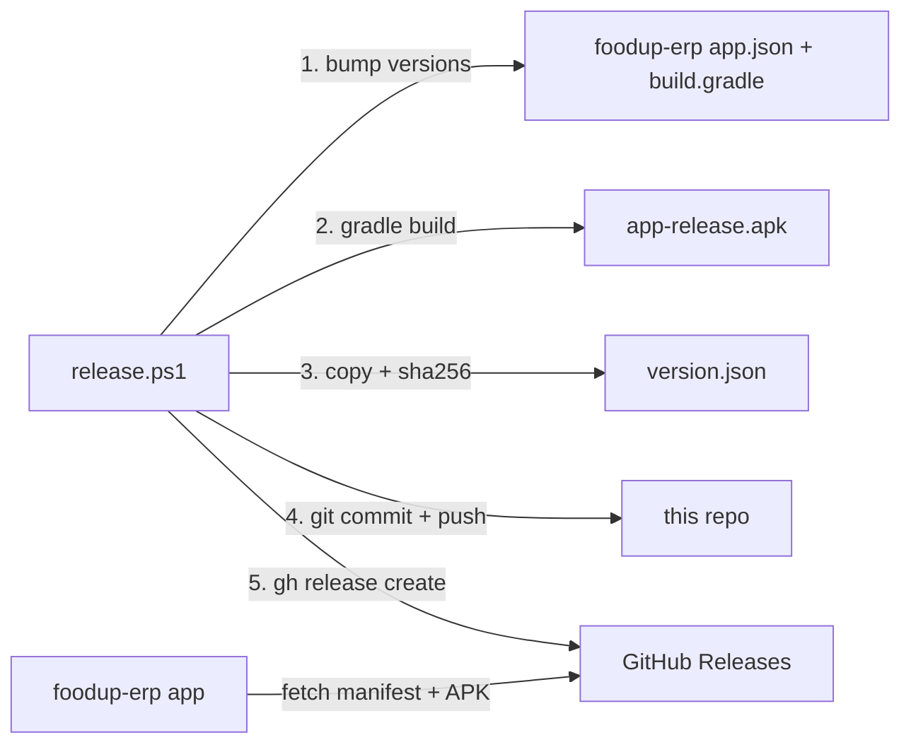

# Release Process

## Overview

Releases are **fully manual** — no CI or GitHub Actions. A PowerShell script in this repo orchestrates version bumping, APK building (in foodup-erp), manifest writing, git commit, and GitHub Release creation.



## Prerequisites

1. **Sibling repo layout:**

   ```
   C:\Users\Tai\Crappy\
   ├── foodup-erp/           ← app source
   └── foodup-erp-releases/  ← this repo
   ```

2. **GitHub CLI** authenticated:

   ```powershell
   gh auth login
   # Install if missing: winget install --id GitHub.cli -e
   ```

3. **Android release keystore** configured in foodup-erp — see [ANDROID_RELEASE_SIGNING.md](../../foodup-erp/docs/ANDROID_RELEASE_SIGNING.md).

4. **Gradle build environment** — Android SDK, Java, native project generated (`npm run android` once in foodup-erp).

## Release command

Run from **foodup-erp** root:

```powershell
..\foodup-erp-releases\scripts\release.ps1 `
  -VersionName "1.0.20" `
  -VersionCode 20 `
  -Notes "Description of changes."
```

## Script parameters

| Parameter | Required | Default | Purpose |
|-----------|----------|---------|---------|
| `-VersionName` | Yes | — | User-visible semver (e.g. `1.0.20`) |
| `-VersionCode` | Yes | — | Android `versionCode` integer (must increase monotonically) |
| `-Notes` | No | `""` | Release notes → manifest + GitHub release body |
| `-MinSupportedVersionCode` | No | `1` | Oldest supported client; below this → mandatory update |
| `-AppRoot` | No | `../foodup-erp` | Path to app repo |
| `-GithubRepo` | No | `JiaYee/foodup-erp-releases` | Target GitHub repo |
| `-SkipBuild` | No | off | Skip version bump + Gradle build; use existing APK |

## Step-by-step (what `release.ps1` does)

1. Verify `gh` is installed and authenticated
2. Resolve foodup-erp sibling path (or use `-AppRoot`)
3. Unless `-SkipBuild`:
   - Bump `expo.version` and `expo.android.versionCode` in `foodup-erp/app.json`
   - Bump `versionCode` / `versionName` in `foodup-erp/android/app/build.gradle`
   - Run `npm run android:gradle:release` in foodup-erp
4. Copy `android/app/build/outputs/apk/release/app-release.apk` → `build/foodup-erp-{VersionName}.apk`
5. Compute SHA-256 hash of APK
6. Write `version.json` with manifest fields
7. `git add version.json` → commit `"Release v{VersionName}"` → `git push` (if changed)
8. `gh release create v{VersionName} {apk} {version.json} --repo JiaYee/foodup-erp-releases --title v{VersionName} --notes {Notes}`

## Versioning scheme

| Concept | Format | Example |
|---------|--------|---------|
| Git tag / GitHub Release | `v{VersionName}` | `v1.0.19` |
| APK filename | `foodup-erp-{VersionName}.apk` | `foodup-erp-1.0.19.apk` |
| Android versionCode | Monotonic integer | 19 |
| versionName | Semver string | `1.0.19` |

**versionCode must always increase** — the OTA client compares integer versionCodes.

## Branch strategy

- Releases are committed to the current branch (typically `develop`)
- **`develop` is ahead of `main`** — OTA clients fetch from GitHub Release assets, not branch HEAD
- GitHub Release tag (`v1.0.19`) is the source of truth for OTA

## Smoke test after release

1. On a device with an older APK, open foodup-erp → **Settings** → **Check for updates**
2. Or restart the app — `UpdatePrompt` checks on startup (Android only)
3. Confirm new version detected, APK downloads and installs

## Troubleshooting

| Issue | Resolution |
|-------|------------|
| `gh auth login` required | Authenticate GitHub CLI |
| App root not found | Ensure foodup-erp is sibling directory |
| Gradle build failed | Check keystore, Android SDK, run `npm run android` once |
| APK not found | Build failed or wrong output path |
| `gh release create` failed — tag exists | Delete existing release/tag or use new version |
| OTA install fails | Signing key must match previous releases |
| App doesn't detect update | Verify `versionCode` increased; check manifest URL |

## Skip-build workflow

To republish an existing APK without rebuilding:

```powershell
..\foodup-erp-releases\scripts\release.ps1 `
  -VersionName "1.0.20" `
  -VersionCode 20 `
  -Notes "Re-publish." `
  -SkipBuild
```

Requires existing `app-release.apk` in foodup-erp's Gradle output directory.

## Git-tracked files

Only 4 files are tracked in git:

- `.gitignore`
- `README.md`
- `scripts/release.ps1`
- `version.json`

APKs in `build/` are gitignored. Release assets live on GitHub Releases.
